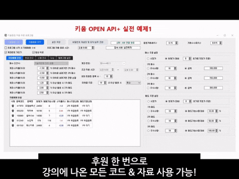

# 🚀 자동매매 개발 시간을 단축하고 싶다면 – 주식코딩 실전 코드 패키지

안녕하세요. **전직 증권사 알고리즘 트레이더 출신**이 운영하는 유튜브 채널 주식코딩입니다.
유튜브 강의는 모두 무료로 제공하지만, 많은 분들이 이런 고민을 합니다.

* 자동매매를 만들다 중간에 막힌다
* API 연결은 했는데 구조가 잡히지 않는다
* 백테스트는 되는데 실전 투입이 어렵다
* 다른 사람의 완성된 설계를 보고 배우고 싶다

👉 이 패키지는 바로 그 문제를 해결하기 위해 만들어졌습니다.

---

## 🎯 이 패키지가 해주는 일

코드를 "주는 것"이 목적이 아닙니다.
**시행착오와 삽질 시간을 줄여주는 것**이 목적입니다.

혼자서 하나하나 만들면 몇 달이 걸릴 수 있는 구조를,
이미 동작하는 형태로 보면서 바로 출발할 수 있습니다.

✔ 실전 운용을 고려한 구조
✔ 반복 개발이 필요 없는 베이스 시스템
✔ 확장 가능한 형태의 설계
✔ 전략 연구에 집중할 수 있는 환경

---

## ⏰ 얼마나 차이가 나냐면

많은 분들이 실제로 이렇게 말합니다.

> "진작 이걸 봤으면 몇 달은 아꼈을 텐데요."

여러분의 **시간을 사는 투자**에 가깝습니다.

---

## 📦 제공되는 것

후원자 전용 저장소 접근 권한이 제공되며 아래 자료들을 사용할 수 있습니다.

* 전자책 및 각종 학습 자료
* 강의에 사용된 모든 예제 코드
* 실습용 프로젝트
* 실전 자동매매 구조 코드
* 지속적인 업데이트 내역

단순 샘플이 아니라, **실제 자동매매를 굴리는 형태에 가까운 코드 베이스**입니다.

---

## 🎬 실제 동작 모습

👉 유튜브에서 동작 과정을 먼저 확인하고 결정할 수 있습니다.
[주식코딩 자동매매 프로그램 시연 모음 보러 가기](https://youtube.com/playlist?list=PLlbsy38S8CCwWkEZ9wzEzlNYD4wdiWN5s&si=g5YWoLwnOf0wHbq-)

---

## 💡 이런 분께 특히 좋습니다

* 빠르게 실전 구조를 이해하고 싶은 분
* 혼자 만들며 길을 헤매는 시간을 줄이고 싶은 분
* 안정적인 자동매매 시스템의 뼈대를 얻고 싶은 분
* 나만의 전략 개발 단계로 빨리 넘어가고 싶은 분

---

## ❓ 왜 무료 강의인데 코드는 유료인가요?

강의는 누구나 공부할 수 있도록 무료로 열어두었습니다.
하지만 코드는 수년간의 시행착오와 실전 경험이 축적된 결과물입니다.

이 가치를 필요로 하는 분들만 선택할 수 있도록 분리해두었습니다.

---

## 🔐 이용 방법

GitHub Sponsors를 통해 후원하시면 즉시 Private 저장소 접근 권한이 열립니다.

👉 **[후원하고 코드 받기](https://github.com/sponsors/StockCodingYouTube)**

GitHub 사용이 처음이라면 아래 영상을 참고하세요.
[GitHub 가입 및 사용 가이드 영상](https://youtu.be/HNTpNwHErro?si=trlklaFe8HDN-wyL)

---

## 🧑‍💻 코딩이 부담된다면?

직접 구현이 어려운 분들을 위해
**맞춤형 자동매매 프로그램 제작 서비스**도 운영하고 있습니다.

🔗 [https://github.com/stockcoding27/StockCodingCustomProgram](https://github.com/stockcoding27/StockCodingCustomProgram)

---

## 📺 강의는 전부 무료입니다

주식코딩 채널에서는 다음과 같은 내용을 무료로 제공합니다.

✔ 파이썬 기초
✔ 증권사 API 활용
✔ 자동매매 시스템 구축
✔ 데이터 분석
✔ 실전 프로젝트

👉 유튜브에서 먼저 충분히 공부해보고 구매를 결정하셔도 됩니다.

---

✨ 영상은 무료로, 코드는 시간을 아끼는 사람에게.
주식코딩은 여러분이 **전략 연구에만 집중할 수 있는 환경
